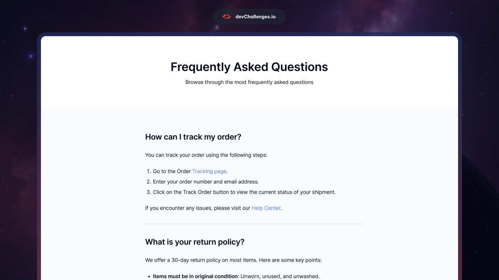

# DevChallenges.io - Simple FAQ Page

## Welcome! 👋

This is a simple FAQ page to practice responsive design.

### Technologies

- HTML5
- CSS

### Author

[@Amtrax](https://github.com/Amtr4x)

### Acknowledge

All design of the page are part of the responsive design roadmap at [_DevChallenges_](https://devchallenges.io/)
